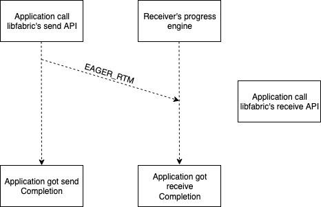
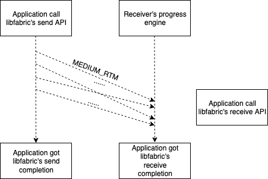
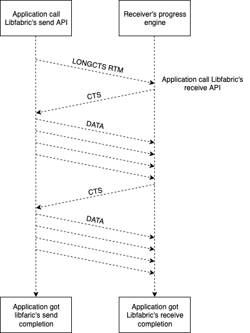
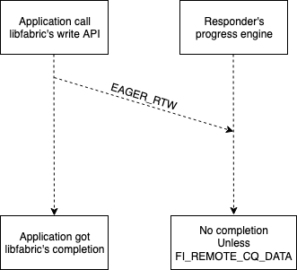
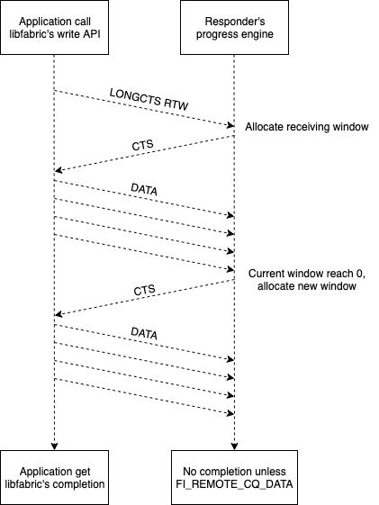
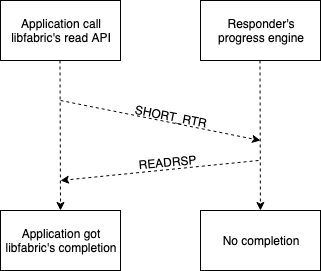
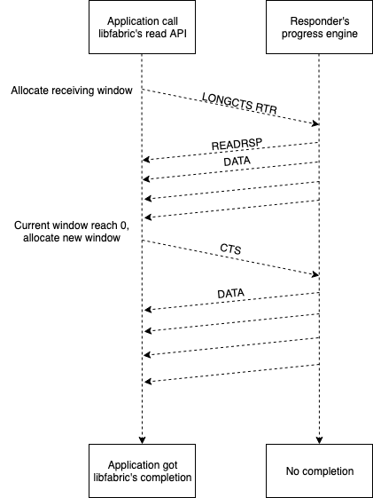
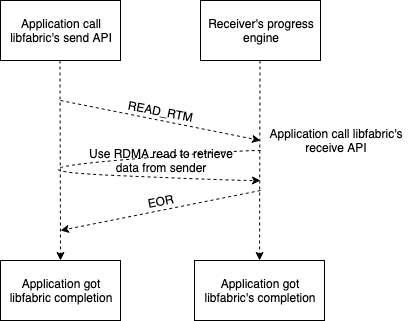
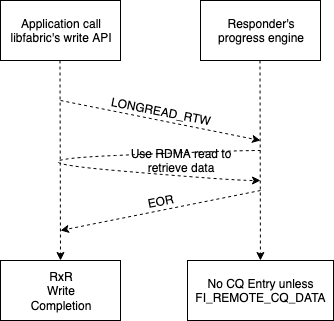

# EFA RDM Communication Protocol version 4

## 0. Overview

This document describes version 4 of EFA RDM communication protocol (protocol v4),
which is adopted by libfabric EFA provider's RDM endpoint since libfabric 1.10.0 release.

The purpose of this document is to provide an definition of the protocol that is
not tied to a specific implementation. It is useful to distinguish protocol and
implementation, because protocol change can cause backward compatibility issue,
therefore needs to be handled with extra care.

It is organized as the following:

Chapter 1 "Basics" introduces some basic facts/concepts of EFA RDM protocol, including:

 * Section 1.1 Why EFA RDM protocol is needed?

 * Section 1.2 A list of features/sub-protocols.

 * Section 1.3 packet, packet base header and a list of packet types.

Chapter 2 "Handshake sub-protocol" describes the handshake sub-protocol, including:

 * Section 2.1 "Handshake sub-protocol and backward compatibility" describes how to introduce
   backward compatible changes to protocol v4, and how handshake sub-protocol is used to
   facilitate the process. 

 *  Section 2.2 "Handshake sub-protocol and raw address exchange" describles how handshake sub-protocol
   impacts the behavior of including raw address in packet header.

 *  Section 2.3 "Implemeation tips" include tips when implementing handshake sub-protocol.

Chapter 3 "baseline features" describes the baseline features of protocol v4.

 *  Section 3.1 "REQ packets" introduces the binary format of REQ packets, which all baseline features
    use to initialize the communication.

 *  Section 3.2 "baseline features for two-sided communications" describe 3 two-sided communication baseline features:

          eager message transfer,
          medium message transfer and
          long-cts message transfer.

 *  Section 3.3 "baseline features for one-sided communications" describe 7 one-sided communication baseline features:

          emulated eager write,
          emulated long-cts write,
          emulated short read,
          emulated long-cts read,
          emulated write atomic,
          emulated fetch atomic and
          emulated compare atomic.

Chapter 4 "extra features/requests" describes the extra features/requests defined in version 4.

 *  Section 4.1 describe the extra feature: RDMA read based message transfer.

 *  Section 4.2 describe the extra feature: delivery complete.

 *  Section 4.3 describe the extra request: stable header length.

 *  Section 4.4 describe the extra request: connid (connection ID) header.

Chapter 5 "what's not covered?" describe the contents that are intentionally left out of
this document because they are considered "implementation details".

## 1. Basics

EFA RDM communication protocol is for two lifabric endpoints to use EFA device to communication
with each other.

### 1.1 Why is EFA RDM communicatio protocol?

The reason we need a EFA RDM communication protocol is beause of EFA device's limited
capability. Currently, EFA device supports the following two types of communications:

 1. send/receive a message up to MTU size (this value is from rdma-core's `ibv_port_attr.max_msg_size`).
 2. RDMA read of a memory buffer up to 1GB (if both endponits' software stacks support RDMA read).
 
Moreover, for send/receive, EFA device does not guarantee ordered delivery, e.g. when sender
sends multiple messages to a receiver, the receiver may receive the packets in an order different
from how they are sent.

Protocol v4 defines how two endpoints can use EFA device's limited capablity to achieve: 

        send/receive up to 2^64-1 bytes,
        read up to 2^64-1 bytes,
        write up to 2^64-1 bytes,
        atomics up to MTU size.

Moreover, protocol v4 defines ways to meet extra requirements of application, which EFA device
does not support, such as ordered send/receive (`FI_ORDER_SAS`) and delivery complete (DC).

### 1.2 a list of sub-protocols

To meet application's specific needs, protocol v4 defines a set of sub-protocols for
as listed in table 1.1:

Table: 1.1 a list of sub-protocols

| Sub Protocol Name             | Used For  | Definition in |
|-|-|-|
| Eager message                 | Two sided | Section 3.2   |
| Medium message                | Two sided | Section 3.2   |
| Long-CTS message              | Two sided | Section 3.2   |
| Long READ message             | Two sided | Section 4.1   |
| DC Eager message              | Two sided | Section 4.2   |
| DC Medium message             | Two sided | Section 4.2   |
| DC Long-CTS message           | Two sided | Section 4.2   |
| Emulated eager write          | One sided | Section 3.3   |
| Emulated long-CTS write       | One sided | Section 3.3   |
| Emulated long-read write      | One sided | Section 4.1   |
| Emulated DC eager write       | One sided | Section 4.2   |
| Emulated DC long-CTS write    | One sided | Section 4.2   |
| Emulated short read           | One sided | Section 3.3   |
| Emulated long-CTS read        | One sided | Section 3.3   |
| Direct read                   | One sided | Section 4.1   |
| Emulated atomic               | One sided | Section 3.3   |
| Emulated fetch atomic         | One sided | Section 3.3   |
| Emulated compare atomic       | One sided | Section 3.3   |
| Handshake                     | Backward compatibility | Chapter 2 |

### 1.3 packet, packet base header and a list of packets

All the sub-protocols (except the Direct Read protocol) use packet(s) to exchange
informaton between two endpoints.

A packet is a message that does not exceed MTU size, and is exchanged between
two endpoint using EFA device's send/receive capability.

Protocol v4 defines a set of packet types. They can be split into two category:
REQ packet types and non-REQ packet types.

Typically, in each sub-protocol, one endpoint send a REQ packet to the other to initialize
the communication. Each sub-protocol is unique, thus each sub-protocol defines its own REQ
packet type.

Depend on the nature of the protocol, there may be additonal non-REQ packets exchanged
between the two endpoints.

To distiguish various types of packets sent/received between two EFA devices,
each packet type was assigned a unique packet type ID. Table 1.2 lists
all the packet types in protocol v4 and sub-protocol(s) that used it:

Table: 1.2 a list of packet type IDs

| Packet Type ID  | Nick Name   | Full Name                 | Used by                       |
|-|-|-|-|
| 1               | RTS         | Request To Send           | Deprecated                    |
| 2               | CONNACK     | CONNection ACKnowlegement | Deprecated                    |
| 3               | CTS         | Clear To Send             | long-CTS message/read/write |
| 4               | DATA        | Data                      | long-CTS message/read/write |
| 5               | READRSP     | READ ReSPonse             | emulated short/long-read      |
| 6               | N/A         | N/A                       | reserved for internal use      |
| 7               | EOR         | End Of Read               | long-read message/write     |
| 8               | ATOMRSP     | ATOMic ResSPonse          | emulated write/fetch/compare atomic |
| 9               | HANDKSHAKE  | Handshake                 | handshake                     |
| 10              | RECEIPT     | Receipt                   | delivery complete             |
| 64              | EAGER_MSGRTM   | Eager non-tagged Request To Message  | eager message |
| 65              | EAGER_TAGRTM   | Eager tagged Request To Message      | eager message |
| 66              | MEDIUM_MSGRTM  | Medium non-tagged Request To Message  | medium message |
| 67              | MEDIUM_TAGRTM  | Medium tagged Request To Message      | medium message |
| 68              | LONGCTS_MSGRTM | Long-CTS non-tagged Request To Message  | long-CTS message |
| 69              | LONGCTS_TAGRTM | Long-CTS tagged Request To Message      | long-CTS message |
| 70              | EAGER_RTW      | Eager Request To Write                  | emulated eager write |
| 71              | LONGCTS_RTW    | Long-CTS Request To Write               | emulated long-CTS write |
| 72              | SHORT_RTR      | Eager Request To Read                   | emulated short read |
| 73              | LONGCTS_RTR    | Long-CTS Request To Read                | emulated long-CTS read |
| 74              | WRITE_RTA      | Write Request To Atomic                 | emulated write atomic |
| 75              | FETCH_RTA      | Fetch Request To Atomic                 | emulated fetch atomic |
| 76              | COMPARE_RTA    | Compare Request To Atomic               | emulated compare atomic | 

The packet type ID is included in the 4 bytes EFA RDM base header, which every packet must be started
with. The format of the EFA RDM base header is listed in table 1.3:

Table: 1.3 format of EFA RDM base header

| Name | Length (bytes) | type | C language type |
|-|-|-|-|
| `type`    | 1 | integer | `uint8_t` |
| `version` | 1 | integer | `uint8_t` |
| `flags`   | 2 | integer | `uint16_t` |

In the table, `type` is the packet type ID.

`version` is the EFA RDM protocol version, which is 4 for protocol v4.

`flags` is a set of flags each packet type uses to customize its behavior. Typically, it is used
to idicate the existance of optional header(s) in the packet header. The format of each packet type
is introduced in the sections where the sub-protocols are introduce.

## 2. Handshake sub-rotocol

Handshake sub-protocol serves two purposes in protocol v4.

First, it is used to exchange two endpoints' capablity information, which allows to introduce
changes to protocol v4 without break backward compatiblity. (section 2.1)

Second, it is used to adjust the behavior of including EFA raw address in REQ packet header
(section 2.2)

### 2.1 Handshake sub-protocol and backward compatibility

The biggest problem when designing a communication protocol is how to maintain backward compatibility
when introduce changes to the protocol. Imaging the following scenario: there are endpoints that are
using protocol v4 in its current form. If a change is made to the protocol, how to make sure that
the existing endpoints still be able to communicate with endpoints that have adopted changes?

To tackle this issue, protocol v4 first introduced the concepts of "feature" and "request".

- A feature is a functionality that an endpoint can support. Typically, a feature
is the support of  a set of sub-protocols.

- A request is an expectation an endpoint has on its peer. Typically, a request is
for its peer to include some extra information in packet header.

Protocol v4 defines the following 10 features as baseline features:

- Eager message (send/receive)
- Medium message (send/receive)
- Long-CTS message (send/receive)
- Emulated eager write
- Emulated long-CTS write
- Emulated short read
- Emulated long-CTS read
- Emulated write atomic
- Emulated fetch atomic
- Emulated compare atomic

The definition of these baseline features are in chapter 3. Any endpoint the adopt protocol
v4 must support these baseline features.

Protocol v4 then allow changes to introduced as "extra feature" and "extra request".
When it is introduced to protocol v4, each extra feature/request will be assigned an ID.
ID start with 0, and increase by 1 for each extra feature/request.

Currently there are 4 such extra features/requests, as listed in table 2.1:

Table: 2.1 a list of extra features/requests

| ID | Name              |  Type    | Introduced since | Described in |
|-|-|-|-|-|
| 0  | RDMA read based data transfer    | extra feature | libfabric 1.10.0 | Section 4.1 |
| 1  | delivery complete                | extra feature | libfabric 1.12.0 | Section 4.2 |
| 2  | keep packet header length stable | extra request | libfabric 1.13.0 | Section 4.3 |
| 3  | sender connection id in packet header  | extra request | libfabric 1.14.0 | Section 4.4 |

How does protocol v4 maintain backward compatibility when extra features/requests are introduced?

First, protocol v4 states that endpoint's support of an extra feature/request, therefore cannot
be assumed.

Second, protocol v4 defines the handshake sub-protocol for two endpoint to exchange its extra
feature/request status. Its workflow is:

1. If an endpoint has never communicated with a peer, it does not know the peer's
   extra/feature request status. Therefore, it can only use the baseline features to
   communicate with a peer, which means it will send REQ packets (section 3.1) to the peer
   to initialize a communication.
2. Upon receiving the 1st REQ packet from a peer, an endpoint will send back a handshake
   packet, which contains the endpoint's capablity information.
3. Upon receiving the handshake packet, an endpoint will know the peer's extra feature/requets
   status.

Regarding extra feature, if the peer support the extra feature the endpoint want to use,
the endpoint can start using the extra feature. Otherwise, one of the following should happen:

- a. the communcation continues without using the extra feature/request, though
   the performance may be sub-optimal. For example, if the peer does not support
   the extra feature "RDMA read based data transfer", the endpoint can choose to
   use baseline features to carry on the communication, though the performance will
   be sub-optimal (section 4.1).

- b. the requester of the communication aborts the communication and return an error
   to the application. For example, if application requires delivery complete, but
   the peer does not support it (this can happen when endpoint is using libfabric 1.12,
   but the peer is using libfabric 1.10), the requester need to return an error to the
   application (section 4.2)

Regarding extra request, if an endpoint can support an extra request the peer has, it
should comply the request. Otherwise, it can ignore the request. Peer should be do
one of the following:

- a. carry on the communication without using the extra request. (see section 4.4
     for example)

- b. abort the communcation and return an error to application. (see section 4.3
     for example)

For example, if sender is using libfabric 1.10, and receiver is using 1.14. Receiver
will have the extra request "connid header", but sender does not support it. In this
case, sender should not do anything special, it is receiver's responsibility to react
accordingly.

This concludes the workflow of the handshake sub-protocol.

The binary format of a HANDSAHKE packet is listed in table 2.2.

Table: 2.2 binary format of the HANDSHAKE packet

| Name      | Length (bytes) | type | C language type |
|-|-|-|-|
| `type`    | 1 | integer | `uint8_t`  |
| `version` | 1 | integer | `uint8_t`  |
| `flags`   | 2 | integer | `uint16_t` |
| `nex_p3`  | 4 | integer | `uint32_t` |
| `exinfo`  | `8 * (nexinfo_p3 - 3)` | integer array | `uint64_t[]` |

The first 4 bytes (3 fields: `type`, `version`, `flags`) is the EFA RDMA base header (section 1.3).

Immediately after the base header, there are 2 fields `nex_p3` and `exinfo`. 

The field `exinfo` is an array of 8 byte integers, which stores the capability of an endpoint.

As mentioned before, each extra feature/request was assigned an ID when it was introduce to procotol v4.
When constructing the handshake packet, for each extra feature it supports (or an extra requst it want to impose),
an endpoint need to toggle on a corresponding bit in the `exinfo` array. Specifically, if an endpoint supports
the exta feature ID with ID `i` (or want to impose extra request with ID `i`), it needs to toggle on the
No. `i%64` bit of the No. `i/64` member of the `exinfo` array.

For example, if an endpoint supports the extra feature "RDMA read based data transfer" (ID 0), it needs to
toggle on the No. 0 (the first) bit of `exinfo[0]`. (section 4.1)

If an endpoint wants to impose the "stable header length" extra request it need to toggle on No 2. bit
in `exinfo[0]`. (section 4.3)

Note, the field `exinfo` was named `features` when protocol v4 was initially introduced, at that time we
only planned for extra features. Later, we discovered that the handshake sub-protocol can also be used to pass
additional request information, thus introduced the concept of "extra request" and renamed this field `exinfo`.

`nex_p3` is number of `exinfo` flags of the endpoint plus 3. The "plus 3" come from for historitcal reasons.
When protocol v4 was initially introduced, this field is named `maxproto`. The original plan was that protocol
v4 can only have 64 extra features/requests. If the number of extra feature/request ever exceeds 64, the next
feature/request will be defined as version 5 feature/request, (version 6 if the number exceeds 128, so on so
forth). The field `maxproto` means maximumly supported protocol version by an endpoint. The receipient of the
HANDSHAKE packet use `maxproto` to calculate how many members `exinfo` has, which is `maxproto - 4 + 1`. (Starting
from v4, each version has 1 flag).

However, it was later realized the original plan is overly complicated, and can cause a lot of confusion.
For example, if an endpoint support a feature defined in version 5, what version number should it put in
the base header? Given that the sole purpose of the field `maxproto` is to provide a way to calculate
how many members the `exinfo` array has, the protocol would be much easier to understand if we re-interpret
the field `maxproto` as `nex_p3` and allow protocol v4 to have more than 64 extra feature/requests.

### 3.2 handshake sub-protocol and raw address exchange

Another functionality of the handshake sub-protocol is to adjust behavior of including raw address in packet header.

Currently, if an endpoint is communicating with a peer for the first time, it will include its raw address
in the REQ packets it sends.

After the endpoint received the HANDSHAKE packet from the peer, it will stop including its raw address
in the header (see section 4.3 for an exception).

This behavior is to compensate for a limitation of EFA device, which is EFA device cannot report
the address of a packet of an unknown sender.

The EFA device keeps an address book, which contains a list of raw addresses of its peer. Each address is assigned
an address handle number (AHN). When EFA device received a message, it will report the AHN of the address.

However, if the address of a received message is not in the address book, there is no AHN assigned to
the address. In this case, and EFA device will not be able to report the AHN.

For the communication to proceed, an endpoint needs to have to the address of any received packet, because
it need to send packets back.

Therefore, if an endpoint is communcating with a peer for the 1st time, it will have to include its raw
address in the header of REQ packets it sends to the peer. (see section 3.1 for the details of REQ packets).

This ensures that when an endpoint received the REQ packet, it can always get the address. If the endpoint
does not have sender's address in address book, it can get the raw address from REQ packet header, then insert
the raw address to the address book.

Note this insertion only need to happen once, for the next packets from the endpoint, the EFA device will be able
to report AHN. Meanwhile, it is inefficient to always have raw address in the packet header, so it is desirable
to have a mechanims for an endpoint to stop including raw address in packet header.

As it turns out, the handshake sub-protocol is the perfect mechanism for that.

In handshake sub-protocol, an endpoint will send a HANDSHAKE packet upon receiving 1st REQ packet from
a peer. At that point, the peer's raw address must have been inserted to its address book.

If an endpoint received a HANDSHAKE packet from a peer, the peer must know the endpoint's addres, therefore
the endpoint can stop including raw address in packet header.

This concludes the discussion of the workflow.

We want to take this opportunity to introduce the binary format of EFA raw address, which is listed in
table 2.3:

Table: 2.3 binary format of EFA raw address

| Name | Lengths (bytes) | type | C language type | Notes |
|-|-|-|-|-|
| `gid`  | 16 | array   | `uint8_t[16]` | ipv6 format |
| `qpn`  |  2 | integer | `uint16_t`    | queue pair number |
| `pad`  |  2 | integer | `uint16_t`    | pad to 4 bytes |
| `connid` | 4 | integer | `uint32_t`   | random connection ID |
| `reserved` | 8 | integer | `uint64_t` | reserved for internal use |

The field `connid` warrants some extra explaination: it is a 4-byte random integer generated
during endpoint initialization, which can be used to identify the endpoint. When protocol v4
was initially introduced, the field `connid` was named `qkey`, which is a concept of
EFA device. Later it is realized that this is in fact a connection ID, which we happen
to use a EFA device's Q-Key.

Currently, the raw address of EFA is 32 bytes, but it can be expanded in the future without
breaking backward compatibility.

### 2.3 Implentation tips

When implementing the handshake sub-protocol, keep in mind that the application
does not know the existance of a HANDSHAKE packet, therefore will not wait
for its completion.

For example, it is normal that a HANDSHAKE packet encounter an send error
because peer has already been closed, because application might just send
1 message and close the endpoint.

It is also possible to close an endpoint when there are on-the-fly HANDSHAKE
packet, because the application might just want to receive 1 message, then
close the endpoint. However, the action of receiving a message, will cause
a HANDSHAKE packet to be sent.

## 3. Baseline features

This part describes the 10 baseline features in protocol v4, which uses only the send/receive
functionality of EFA device, and should be supported by any endpoint that implements protocol v4.

### 3.1 REQ packet types

Before getting into details of each baseline feature, we give a general introduction to
the REQ packet types, which all these baseline features use to initialize the communication.

REQ packets is not one but a category of packet types. In this chapter, 10 REQ packet types will be
covered, as each baseline feature has its own REQ packet type.

According to the type of communications it is used for, REQ packet types can be further divided into
4 cartegoreis:

RTM (Request To Message) is used by message sub-protocols (for two-sided communication). RTM can be
further divided into MSGRTM and TAGRTM. TAGRTM is used when application calls libfabric's tagged
send/receive API (such as `fi_tsend` and `fi_trecv`).

RTW (Request To Write) is used by emulated write sub-protocols.

RTR (Request To Read) is used by emulated read sub-protoocls.

RTA (Request To Atomic) is used by emulated atomic sub-protocols.

Regardless, all REQ packets are consisted of 3 parts: REQ mandatory header, REQ optional header and
application data (optional).

**REQ mandatory header** is unique for each invididual REQ packet type. However, they all must start with
the same 4 bytes EFA RDM base header (section 1.3). Recall that a base header is consisted with 3 fields:
`type`, `version` and `flags`. Among them, `flags` warrants more discussion here, as all REQ packets share
the same set of flags, which is listed in table 3.1:

Table: 3.1 a list of REQ packet flags

| Flag | name | meaning |
|-|-|-|
| 0x1  | `req_opt_raw_addr_hdr` | This REQ packet has the optional raw address header |
| 0x2  | `req_opt_cq_data_hdr`  | This REQ packet has the optional CQ data header |
| 0x4  | `req_msg`              | This REQ packet is used by a the two-sided communication |
| 0x8  | `req_tagged`           | This REQ packet is used by a tagged two-sided communcation |
| 0x10 | `req_rma`              | This REQ packet is used by an emulated RMA (read or write) commucation |
| 0x20 | `req_atomic`           | This REQ packet is used by an emulated atomic (write,fetch or compare) communication |
| 0x40 | `req_opt_connid_hdr`   | This REQ packet has the optional connid header |

**REQ optional headers** contain addtional information needed by the receiver of the REQ packets.
As mentioned eailer, the existance of optional header in a REQ packet is indicated by bits in the `flags`
field of the base header. There are currently 3 REQ optional headers defined:

1. the raw address header, which has the following format:

Table: 3.2 format of REQ optional raw address header

| Field | type    | Length | C type |
|-|-|-|-|
| `size`  | integer | 4      | uint32 |
| `addr`  | array   | `size` | uint8[] |

As can be seen, the optional raw address is consisted of two fields `size` and `addr`. The field `size` describles
number of bytes in the `addr` array. The field `addr` contains the raw address. The `size` field is necessary because
the raw address format of EFA can be expended in the future.

As mentioned before, an endpoint will include raw address in REQ packet before it receives a handshake packet back
from a peer. This is because the peer might not have the endpoint's raw address in its address vector, thus cannot
communicate with the endpoint.

2. the CQ data header, which is an 8 byte integer. CQ data header is used when application called libfabric's
CQ data send/write API (such as `fi_senddata`, `fi_tsenddata` and `fi_writedata`), which will include an extra
data in the RX completion entry written to application.

3. the connid (connection ID) header, which is a 4 byte integer. It is used when peer has the "connid header"
extra request, and the endpoint can support it. More information about this header in section 4.4.

Note, it is possible to have multiple optional REQ headers in one REQ packets. In this case, the order they appear
in the REQ packets must be the same as their bit appear in the `flags` field. e.g. the raw address header
must precede the CQ data header, and the CQ data header must precede the connid header.

**Application data** follows immediately after the optional header. Note that not all REQ packet types contain
application data. For example, the RTR (Request To Read) packet type does not contain application data.

### 3.2 baseline features for two-sided communication

This section describes the 3 baseline features for two sided communication: eager message, medium message, long-CTS message.
Each of them correspond to the same named sub-protocol. When describing a sub-protocol, we always follow
the same structure: workflow, packet format and implementation tips.

#### Eager message feature/sub-protocol

Eager message feature/sub-protocol is used when application's send buffer is small enough to be fit in one packet.
This protocol works in the following order:

1. On sender side, application call libfabric's send API, providing a send buffer.
2. On receiver side, application call libfabric's receive API, providing a receive buffer.
3. Sender sends an EAGER_RTM (EAGER_MSGRTM or EAGER_TAGRTM) packet, which contains the application's data.
4. Upon receiving the packet, receiver will process the received packet, and make sure the received
   data is in application's receive buffer.

The following diagram illustrate the workflow:

The mandatory header of an EAGER_RTM packet is described in table 3.3:

Table: 3.3 format of an EAGER_RTM packet

| Name | Length (bytes) | type | C language type | Note |
|-|-|-|-|-|
| `type`      | 1 | integer | `uint8_t`  | part of base header |
| `version`   | 1 | integer | `uint8_t`  | part of base header|
| `flags`     | 2 | integer | `uint16_t` | part of base header |
| `msg_id`    | 4 | integer | `uint32_t` | message ID |
| `tag`       | 8 | integer | `uint64_t` | for eager TAGRTM only |

The field `msg_id` records the sending order of all RTM packets between two endpoint.
Receiver can use it to re-order the received RTM packet from the endpoint.

When implementing the eager message sub-protocol, there are a few points worth attention:

1. Noticing that `msg_id` is 4 bytes integer, which means its maximum value is 4,294,967,295.
After it reaches the maximum value, next msg's `msg_id` will became 0. This "wrap around" of
message id can happen when two endpoints communicate for an extensive period of time. Implementation
must be able to handle it.

2. receiver can either use application buffer to receive data directly (such an implementation is called zero copy receive),
or it can use a bouce buffer to temporarily hold the application data and copy the data to application's receive buffer
later. The difficulty of implementating zero copy receive is that EFA device does not guarantee ordered delivery (see Part 0),
therefore if application want ordered send (`FI_ORDER_SAS`), using a bounce buffer might be the only choice.

3. if a bounce buffer is to be used to receive packets, the receiver need to be able to handle an "unexpected message", which
is the eager RTM packet arrived before application called libfabric's receive API.

4. if application does not require ordered send, it would be possible to use application's receive buffer to receive data
directly. In this case, receiver might need the sender to keep the packet header length constant through out the communcation.
The extra request "stable header length" is designed for this use case, see chapter 4.3 for more discussion on this topic.

5. One might notice that there is no application data length in the header, so how can the receiver of an eager RTM packet
   know how many application data is in the packet? The answer is to use the following formula:

        application_data_length = total_packet_size - RTM mandatoary header length - REQ optional header length
   
   total packet size is reported by EFA device when a packet is received. REQ optional header length can be derived from
   the `flags` field in the base header. The choice of not including data length in the header is because eager messages
   are most sensitive to header length, and we want its header to be as compact as possible.

#### Medium message feature/sub-protoocl

Medium message protocol split application data into multiple MEDUM_RTM (either MEDIUM_MSGRTM or
MEDIUM_TAGRTM) packets, and sender will try send them at once.

In principal, medium message sub-protocol can be used on message with any sized. However, it is not
recommended to use medimum message sub-protocol for long messages, because it does not have flow
control thus can overwhelm the receiver and cause network congestion. The exact size boundary for
medium message protocol to be used is up to the implementation to decide.

The following diagram illustrates its workflow:

Table 3.4 describe the binary structure of a MEDIUM_RTM packet's mandatory header:

Table: 3.4 the format of a MEDIUM_RTM packet's mandatory header

| Name | Length (bytes) | type | C language type | Note |
|-|-|-|-|-|
| `type`        | 1 | integer | `uint8_t`  | part of base header |
| `version`     | 1 | integer | `uint8_t`  | part of base header|
| `flags`       | 2 | integer | `uint16_t` | part of base header |
| `msg_id`      | 4 | integer | `uint32_t` | message ID |
| `seg_length` | 8 | integer | `uint64_t` | application data length |
| `seg_offset` | 8 | integer | `uint64_t` | application data offset |
| `tag`         | 8 | integer | `uint64_t  | for medium TAGRTM only |

Most of the fields have been introduce before, and their meaning does not change.
The two new fields are `seg_length` and `seg_offset`. (`seg` means segment, which
refers to the segment of data in the packet)

`seg_length` is the length of data segment in the medium RTM packet.

`seg_offset` is the offset of data segment in the original send buffer.

`seg_offset` seems redundent at the first glance, as it can be deduced
from the `seg_lenght` of other packets.

However, because EFA device does not guarantee ordered delivery, thus
the MEDIUM_RTM packets of same message can arrive in different order.
Therefore, the recipent of MEDIUM_RTM packets need `seg_offset` to
put the data in the correct location in the receive buffer.

When implementing the medium message protocol, please keep in mind
that because EFA device has a limited TX queue (e.g. it can only send
limited number of packets at a time), it is possible when
sending multiple medium RTM packets, some of them were sent successfully,
others were not sent due to temporary out of resource. Implementation needs
to be able to handle this case.

Note, this "partial send" situation is unique to medium message sub-protocol
because medium message sub-protocol is the only one that sends multiple
REQ packets. In all other protocol, only 1 REQ packet was sent to initialize
the communication, if the REQ failed to send, the whole communication is
cancelled.

#### Long-CTS message feature/sub-protocol

Long-CTS message protocol is designed for long messages, because it supports flow control.

In long-CTS message protocol, the receive send a CTS (Clear To Send) packet back to the
sender to suggest how many data it can handle, and the sender will adjust its behavior
accordingly.

The workflow of long-CTS protocol is demonstrated in the following diagram:

As can be seen, the sender will send a LONGCTS_RTM (either LONGCTS_MSGRTM or LONGCTS_TAGRTM)
packet to the receiver.

Upon receiving the LONGCTS_RTM, receiver will match it with an application's call to
libfabric's receive API. Receiver will then calculate how many data it can handle,
and include that information in a CTS packet it sends back to the sender.

Upon receiving the CTS packet, sender will send multiple DATA packets according to
information in the CTS packet.

After receiving all the DATA packets it was expecting, receiver will calculate and
send a CTS packet again.

The above process repeat until all data has been sent/received.

There 3 packet types involved in the long-CTS message sub-protocol: LONGCTS_RTM, CTS
and DATA.

A LONGCTS RTM packet, like any REQ packet, is consisted with 3 parts: LONGCTS RTM mandatory
header, REQ optional header and application data.

The format of the LONGCTS_RTM mandatory header is listed in table 3.5:

Table: 3.5 The format of a LONGCTS_RTM packet's mandatory header

| Name | Length (bytes) | type | C language type | Note |
|-|-|-|-|-|
| `type`           | 1 | integer | `uint8_t`  | part of base header |
| `version`        | 1 | integer | `uint8_t`  | part of base header|
| `flags`          | 2 | integer | `uint16_t` | part of base header |
| `msg_id`         | 4 | integer | `uint32_t` | message ID |
| `msg_length`     | 8 | integer | `uint64_t` | total length of the whole message |
| `send_id`        | 4 | integer | `uint32_t` | ID of the ongoing TX operation |
| `credit_request` | 4 | integer | `uint64_t` | number of data packets prefered to send |
| `tag`            | 8 | integer | `uint64_t` | for LONGCTS TAGRTM only |

There are 3 fields that is new:

`msg_length` is the length of the whole application message.

`send_id` is an ID the sending endpoint assigned to the send operatione, and receive should include
`send_id` in CTS packet. An endpoint will have multiple send operations at the same time, thus
when processing a CTS packet from a receive, it needs a way to locate the send operation the
CTS packet is referring to.

Admittedly, the introduction of `send_id` is not absolute necessary, because receiver could have
included `msg_id` in CTS header, and sender should be able to locate the send operation using
the combination of receiver's address and message ID. However, that approach would require
the sending endpoint set up an address + `msg_id` to send map, and look up the map every time
it received a CTS packet. We considered that approach too burdensome for an endpoint to implmement
and decided to introduce a 4 byte `send_id` in LONGCTS RTM header to eliminate the cost.

Another note about `send_id` is that it can be reused between messages. Because `send_id` is used to
distinguish on-the-fly TX operations, so a send operation may have the same `send_id` as a previous
one that has already finished.

The field `send_id` was named `tx_id` when the protocol was initially introduced. It is renamed
because the new name is clearer.

The field `credit_request` is how many DATA packets the sender wish to receive from the receiver,
the receiver will try to honor the request, but is not obligated to. However, receiver must allow
the sender to send at least 1 DATA packet back, to keep the communication moving forward.

Besides the LONGCTS_RTM packet, there are two other packet types used by the long-CTS message protocol:
CTS and DATA.

The binary format of a CTS packet is listed in table 3.6:

Table: 3.6 the binary format a CTS packet

| Name | Length (bytes) | type | C language type | Note |
|-|-|-|-|-|
| `type`           | 1 | integer | `uint8_t`  | part of base header |
| `version`        | 1 | integer | `uint8_t`  | part of base header|
| `flags`          | 2 | integer | `uint16_t` | part of base header |
| pad              | 4 | array   | `uint8_t`  | used for 8 byte alignment |
| `send_id`        | 4 | integer | `uint32_t` | send id from LONGCTS RTM |
| `recv_id`        | 4 | integer | `uint32_t` | receive id to be used in DATA packet |
| `recv_length`    | 8 | integer | `uint64_t` | number of bytes the receiver is ready to receive |
| `connid`         | 4 | integer | `uint32_t` | optional sender connection id (see chapter 4.4 for more detail) |

The 3 new fields in the header are `pad`, `recv_id` and `recv_length`.

The field `pad` is 4 byte padding to make the variables align on 8 bytes boundary.

The field `recv_id` is similar to `send_id` introduced eariler, but for an on-going receive operation.
Sender should include `recv_id` in the DATA packet.

The filed `recv_length` is the number of bytes receiver is ready to receive for this operation,
it must be > 0 to make the communication going forward.

CTS packet does not contain application data.

A DATA packet is consisted of two parts: DATA packet header and application data.
Table 3.7 shows the binary format of DATA packet header:

Table: 3.7 the binary format of DATA packet header

| Name | Length (bytes) | type | C language type | Note |
|-|-|-|-|-|
| `type`           | 1 | integer | `uint8_t`  | part of base header |
| `version`        | 1 | integer | `uint8_t`  | part of base header|
| `flags`          | 2 | integer | `uint16_t` | part of base header |
| `recv_id`        | 4 | integer | `uint32_t` | recv ID from the CTS packet |
| `data_length`    | 8 | integer | `uint32_t` | length of the application data in the packet |
| `data_offset`    | 8 | integer | `uint64_t` | offset of the application data in the packet |
| `connid`         | 4 | integer | `uint32_t` | optional sender connection id (see chapter 4.4 for more detail) |

All the fields has been explained before.

When implementing the long-CTS protocol, please keep in mind that although each implementation is allowed
to choose its own flow control algorithm. They must allow some data to be sent in each CTS packet, e.g
the `recv_length` field in CTS packet must be > 0. This is to avoid infinite loop.

### 3.3 baseline featrues for one-sided communication

This section explain the 7 baseline features for one-sided communication. These features/sub-procotols
emulate one-sided operation by using send/receive functionality of the device. The 7 features are:
emulated eager write, emulated long-CTS write, emulated short read, emulated long-CTS read, emulated write
atomic, emulated fetch atomic and emulated compare atomic.

Before getting into details of each feature, we want to discuss some topics related to one-sided operation.

There are 3 types of one-sided operations: write, read and atomic.

Like in two-sided communcation, there are also two endpoints involved in one-sided communcation.
However, only on one side will application call libfabric's one-sided API (such as `fi_write`,
`fi_read` and `fi_atomic`). In protocol v4, this side is called requster.

On the other side (which is called responder), application does not make calls to lifabric API call,
but the EFA provider requires application to keep the progress engine running on responder side
to facilitate the communication. This is because EFA provider only support `FI_PROGRESS_MANUAL`.

Generally, in one-sided communication, only on the requester side will lifabric write a completion
to notify the application that an one-sided communication is finished. Only exception to this
rule is when application added the `FI_REMOTE_CQ_DATA` flag when calling libfabric's write API,
in this case, the provider is required to write an CQ entry on responder side with the CQ data in it.

(In fact, there is another exception to this rule: which is if a provider claims support for
the `FI_RMA_EVENT` capability, the provider will need to write CQ entry for any one-sided operation
on the responder side. However, this exception does not apply to EFA provider because the EFA provider
does not support the `FI_RMA_EVENT` capability.)

One key difference between one-sided and two-sided comunication is that: in one-sided communication, the
requester must know the remote buffer's information when submitting the request.

In protocol v4, because one-sided operations are emulated, the remove buffer's information are stored
in REQ packet header. For that, protocol v4 defines a data type `efa_rma_iov`, which is used by
all REQ packets for one-side communication.

A `efa_rma_iov` struct is consisted of 3 members: `addr`, `len` and `key`. Each member is a 8 byte integer.
`addr` is the remote buffer address, `len` is the remote buffer length, and `key` is the memory registration
key for the remote buffer, which is provided by the responder through prior communication.

Another difference is that one-sided operation does not support tag matching, thus each one-sided
sub-protocol only needs to define 1 REQ packet type.

# emulated eager write feature/sub-protocol

Emulated eager write sub-protocol is used when the buffer size is small enough to fit in one
packet.

The workflow of the emulated eager write protocol is shown in the following diagram:

Emulated eager write protocol is similar to eager message protocol, except an EAGER_RTW
is used to initiate the communication. Like other REQ packets, an eager RTW packet is consisted of eager RTW mandatory header,
REQ optional header and application data. The binary format of EAGER_RTW manadatory header is listed
in table 3.8:

Table: 3.8 the binary format of EAGER_RTM packet's mandatory header
 
| Name | Length (bytes) | type | C language type | Note |
|-|-|-|-|-|
| `type`           | 1 | integer | `uint8_t`  | part of base header |
| `version`        | 1 | integer | `uint8_t`  | part of base header|
| `flags`          | 2 | integer | `uint16_t` | part of base header |
| `rma_iov_count`  | 4 | integer | `uint32_t` | number of RMA iov structure |
| `rma_iov`        | `rma_iov_count` * 24 | array of `efa_rma_iov` | `efa_rma_iov[]` | remote buffer information |

One thing worth noting is that there is no `msg_id` in the eager RTW header, because EFA provider does not support
ordered write operation.

# emulated long-CTS write feature/sub-protocol

emulated long-CTS write sub-protocol is used when the buffer size is too big to fit in one packet.

The workflow of emulated long-CTS write general follow the long-CTS message sub-protocol, as illustrated
in the following diagram:

The main difference between the two procotol is that the LONGCTS_RTW packet is used instead of the
LONGCTS_RTM packet. The binary format of LONGCTS_RTW packet's mandatory header is listed in table 3.9:

Table: 3.9 the format of LONGCTS_RTM packet's mandatory header

| Name | Length (bytes) | type | C language type | Note |
|-|-|-|-|-|
| `type`           | 1 | integer | `uint8_t`  | part of base header |
| `version`        | 1 | integer | `uint8_t`  | part of base header|
| `flags`          | 2 | integer | `uint16_t` | part of base header |
| `rma_iov_count`  | 4 | integer | `uint32_t` | number of RMA iov structure |
| `msg_length`     | 8 | integer | `uint64_t` | total length of the application buffer |
| `send_id`        | 4 | integer | `uint32_t` | ID of send operation |
| `credit_request` | 4 | integer | `uint32_t` | number of packets requester is ready to send |
| `rma_iov`        | `rma_iov_count` * 24 | array of `efa_rma_iov` | `efa_rma_iov[]` | remote buffer information |

All fields have been described before, but some explaination is warranted for the `send_id` field. It is not
named `write_id` because this protocol is using send/receive to emulated write, therefore it is implied that
the requester is treating this communication as a send operation internally, and this communication is subject
to same flow control as a long-CTS message communicationon does.

# emulated read features/sub-protocols

This section describes two emulated read sub-protocols: emulated short read and emulated long-CTS read. Both
sub-protocols use send/receive to emulate read. The interesting part is, in an emulated read communication,
the responder is the sender and the requester is the receiver.

The workflow of emulated short read protocol is illustrated in the following diagram:

As can be seen, in this protocol, the requester send a short RTR packet to the responder and the responder send
a READRSP packet back to the requster.

The binary format of a SHORT_RTR mandatory header is listed in the table 3.10:

Table: 3.10 the format of a SHORT_RTR packet's mandatory header

| Name | Length (bytes) | type | C language type | Note |
|-|-|-|-|-|
| `type`           | 1 | integer | `uint8_t`  | part of base header |
| `version`        | 1 | integer | `uint8_t`  | part of base header|
| `flags`          | 2 | integer | `uint16_t` | part of base header |
| `rma_iov_count`  | 4 | integer | `uint32_t` | number of RMA iov structure |
| `msg_length`     | 8 | integer | `uint64_t` | total length of the application buffer |
| `recv_id`        | 4 | integer | `uint32_t` | ID of the receive operation, to be included in READRSP packet |
| `padding`	   | 4 | integer | `uint32_t` | alignment for 8 bytes |
| `rma_iov`        | `rma_iov_count` * 24 | array of `efa_rma_iov` | `efa_rma_iov[]` | remote buffer information |

Among the fields, the `recv_id` is most interesting. As mentioned before, in an emulated read protocol, the requester is the
receiver, so it is necessary to include `recv_id` in the request. The responder needs to include this `recv_id` in
the READRSP packet, for the requester to properly process it.

A READRSP (READ ReSPonse) packet is constisted of two parts: READRSP header and application data. The binary format
of the READRSP header is in table 3.11:

Table: 3.11 the format of a READRSP packet's header

| Name | Length (bytes) | type | C language type | Note |
|-|-|-|-|-|
| `type`           | 1 | integer | `uint8_t`  | part of base header |
| `version`        | 1 | integer | `uint8_t`  | part of base header|
| `flags`          | 2 | integer | `uint16_t` | part of base header |
| `padding`	   | 4 | integer | `uint32_t` | alignment for 8 bytes |
| `send_id`        | 4 | integer | `uint64_t` | ID of the send operation, to be included in the CTS header |
| `recv_id`        | 4 | integer | `uint32_t` | ID of the receive operation  |
| `data_length`    | 8 | integer | `uint64_t` | length of the application data in the packet |
| `connid`         | 4 | integer | `uint32_t` | sender connection ID, this field is optional see section 4.4 for more details |

The workflow of the emulated long-CTS read sub-protocol is illustrated in the following diagram:

The protocol started by the requester send a LONGCTS_RTR packet. After that, the workflow generally follow that of the
long-CTS message sub-protocol, except the responder is the sender and the requester is the receiver.

The mandatory header of LONGCTS_RTR packet is listed in table 3.12:

Table: 3.12 the format of a LONGCTS_RTR packet's mandatory header

| Name | Length (bytes) | type | C language type | Note |
|-|-|-|-|-|
| `type`           | 1 | integer | `uint8_t`  | part of base header |
| `version`        | 1 | integer | `uint8_t`  | part of base header|
| `flags`          | 2 | integer | `uint16_t` | part of base header |
| `rma_iov_count`  | 4 | integer | `uint32_t` | number of RMA iov structure |
| `msg_length`     | 8 | integer | `uint64_t` | total length of the application buffer |
| `recv_id`        | 4 | integer | `uint32_t` | ID of the receive operation, to be included in READRSP packet |
| `recv_length`	   | 4 | integer | `uint32_t` | Number of bytes the responder is ready to receive |
| `rma_iov`        | `rma_iov_count` * 24 | array of `efa_rma_iov` | `efa_rma_iov[]` | remote buffer information |

The only difference between LONGCTS_RTR and SHORT_RTR is the field `padding` in SHORT_RTR is replaced by the field `recv_length`.
Here, the LONGCTS_RTR packet serves the same functionality of the first CTS packet in long-CTS message sub-protocol. The reason
is: when the endpoint is prepparing the LONGCTS_RTR, it already knows it is going to receive some data, thus it should calculate
how many bytes it is ready to receive using the flow control algorithm, and put the number in the packet.

## 4. Extra features and requests

This chapter describes the extra features and requests of protocol v4.

### 4.1 RDMA read based data transfer (RDMA read)

The extra feature "RDMA read based data transfer" (RDMA read) was introduce together
with protocol v4, when libfabric 1.10 was released. It was assigned ID 0.

It is defined as an extra feature because there is a set of requirements (firmware,
EFA kernel module and rdma-core) to be met before an endpoint can use the RDMA
read capability, therefore an endpoint cannot assume the other party support RDMA read.

The "RDMA read" extra feature corresponds to the following sub-protocols:
long-read message, emulated long-read write, direct read.

#### Long-read message sub-protocol

The long-read message sub-protocol uses RDMA read to implement two-sided communication.

The work flow of long-read message sub-protocol is illustrated in the following diagram:

There are two packet types involved in this protocol: LONGREAD_RTM and EOR (End Of Read).

LONGREAD_RTM is sent by the sender to initiate the communication. The binary format of 
a LONGREAD_RTM packet's mandatory header is listed in table 4.1

Table: 4.1 the binary format of a LONGREAD_RTM packet's mandatory header

| Name | Length (bytes) | type | C language type | Note |
|-|-|-|-|-|
| `type`           | 1 | integer | `uint8_t`  | part of base header |
| `version`        | 1 | integer | `uint8_t`  | part of base header|
| `flags`          | 2 | integer | `uint16_t` | part of base header |
| `msg_id`         | 4 | integer | `uint32_t` | message ID |
| `msg_length`     | 4 | integer | `uint64_t` | total length of the message |
| `send_id`        | 4 | integer | `uint32_t` | ID of the receive operation  |
| `read_iov_count` | 4 | integer | `uint32_t` | number of iov to read |
| `read_iov`       | `read_iov_count` * 24 | array | `efa_rma_iov[]` | read iov information |

In LONGREAD_RTM packet mandatary header, there are two new fields `read_iov_count` and `read_iov`.
They are different from the `rma_iov_count` and `rma_iov` fields introduce in chapter 3.
`rma_iov_count` and `rma_iov` is provided by application when it called libfabric's one-sided API.
In long-read message sub-protocol, sender need to construct the `read_iov_count` and `read_iov`
from the send buffer provided by application. For that, sender need to make sure the send buffer
is registered with EFA device and fill the registration key in `read_iov`. There are two ways
to achieve that: first, if the buffer has already been registered with device, application will provide
a memory descriptor along with the sender buffer, registration key can be extrated from the descriptor;
second, if the buffer has not been registered with EFA device, sender need to register the buffer,
and can get the key from the registration. Note because memory registration is a limited resource,
it is possible for memory registration to fail and sender need to be able to handle the case.

Upon receiving a long-read RTM, the receiver will use RDMA read to copy data from application's
send buffer to appllication's receive buffer (avoiding copy). That is why this protocol is
sometime referred as zer-copy.

After all read is finished, the receiver will send an EOR packet to the sender to notify it
the work is done.

The binary format of the EOR packet is listed in table 4.2

Table: 4.2 the format of an EOR packet

| Name | Length (bytes) | type | C language type | Note |
|-|-|-|-|-|
| `type`           | 1 | integer | `uint8_t`  | part of base header |
| `version`        | 1 | integer | `uint8_t`  | part of base header|
| `flags`          | 2 | integer | `uint16_t` | part of base header |
| `send_id`        | 4 | integer | `uint32_t` | ID of the send operation |
| `recv_id`        | 4 | integer | `uint32_t` | ID of the receive operation |
| `connid`         | 4 | integer | `uint32_t` | optional sender connection ID, see section 4.4 for more detail|

#### emulated long-read write sub-protocol

The emulated long-read write sub-protocol uses RDMA read to emulate an write operation.

The workflow of this protocol is illustrated in the following diagram:

The workflow is similar to that of long-read message sub-protocol. One key difference is that
a long-read RTW packet is used to initiate the communication. The binary format of the LONGREAD_RTM
packet mandatory header is listed in table 4.3.

Table: 4.3 the format of a LONGREAD_RTM packet's mandatory header

| Name | Length (bytes) | type | C language type | Note |
|-|-|-|-|-|
| `type`           | 1 | integer | `uint8_t`  | part of base header |
| `version`        | 1 | integer | `uint8_t`  | part of base header|
| `flags`          | 2 | integer | `uint16_t` | part of base header |
| `rma_iov_count`  | 4 | integer | `uint32_t` | message ID |
| `msg_length`     | 8 | integer | `uint64_t` | total length of the message |
| `send_id`        | 4 | integer | `uint32_t` | ID of the receive operation  |
| `read_iov_count` | 4 | integer | `uint32_t` | number of iov to read |
| `rma_iov`        | `rma_iov_count` * 24 | array | `efa_rma_iov[]` | write iov information |
| `read_iov`       | `read_iov_count` * 24 | array | `efa_rma_iov[]` | read iov information |

One thing worth noting is that there are two `efa_rma_iov` array in the header: `rma_iov` and `read_iov`.
Though both have been explained before, this is the first time they appear in same header, so it might
be helpful to revisit them. The field `rma_iov_count` and  `rma_iov` are provided by application,
which application called libfabric's write API. They contain information of the target buffer (of write)
on the responder side. The field `read_iov_count` and `read_iov` is constructed by the write requester,
which contains information of the source buffer (of write) on the requester side. The write responder
will use RDMA read to copy data from `read_iov` to `rma_iov`, which from application's point of view
is writing data from source buffer to target buffer.

#### direct read sub-protocol

Direct read sub-protocol is the simplest sub-protocol in protocol v4. It does not involve a REQ packet.
The workflow is just for read requester keep using RDMA read on the responder. For this protocol, it is
not necessary that responder keep progress engine running.

### 4.2 delivery complete

The extra feature "delivery complete" was introduced with libfabric 1.12.0, and was assigned ID 1.

Delivery complete is a requirement application can impose on an endpoint when opening the endpoint.
It requires that when application got the send/write completion, the application data must have
been delivered to application's target buffer.

The reason it is implemented as an extra feature is because, not all sub-protocols in the baseline
features support delivery complete. Specifically, the following 6 sub-protocols does NOT;

         eager message,
         medium message,
         long-CTS message,
         eager write,
         long-CTS write and
         write atomic.

These sub-protocols are designed to support a weaker completion model: transmit complete.
Transmit complete requires that when the send/write completion was written, the data has been transmitted
to the receiver/responder.

The difference between transmit complete and delivery complete is transmit complete indicate
that data has arrived at A buffer on the receive/responder, but the buffer is not necessary the application's
target buffer. buffer. In fact, because of the limitation of the EFA device and (no ordering guarantee) and the nature
of the communcations (emulated write), for some protocols, the implementation have to use a temporary
buffer to receive data, and copy the data to application buffer later, and the time difference can be indefinite.

The "delivery complete" extra feature was introduced to support applications with such requirements.
It comes with 6 sub-protocols:

         DC eager message,
         DC medium message,
         DC long-CTS message,
         DC eager write,
         DC long-CTS write and
         DC write atomic.

The workflow of these sub-protocols are same to that of there non-DC counterpart, with 3 differences changes:

First, each DC capable sub-protocol defines its own REQ packet type.

Second, after data was delivered to application buffer, the receiver/responder will send a RECEIPT
packet back to the sender/requester.

Third, sender/responder will not write completion until it received the RECEIPT packet.

The binary format of a RECEIPT packet is as the following:

| Name | Length (bytes) | type | C language type | Note |
|-|-|-|-|-|
| `type`           | 1 | integer | `uint8_t`  | part of base header |
| `version`        | 1 | integer | `uint8_t`  | part of base header|
| `flags`          | 2 | integer | `uint16_t` | part of base header |
| `send_id`        | 4 | integer | `uint32_t` | ID of the send operation |
| `msg_id`         | 4 | integer | `uint32_t` | message ID |
| `padding`        | 4 | integer | `uint32_t` | make header to align at 8 bytes |
| `connid`         | 4 | integer | `uint32_t` | optional sender connection id, see section 4.4 for more detail |

### 4.3 keep packet header length stable (stable header length) and zero-copy receive

The extra request "keep packet header length stable" (stable header length) was introduced in libfabric 1.13.0
release, and was assigned the ID 2.

This extra request would be useful if endpoint want to implement the "zero copy receive" optimization.

As can be seen from previous discussion, because EFA device does not support ordered delivery, an endpoint
ususally needs to use a temporary buffer to receive incoming packets, and copy data to application's receive buffer
later. However, if an application has the following set of requirment:

   1. does not need ordered send/receive (`FI_ORDER_SAS`).
   2. only send/receive eager messages.
   3. does not use tagged send.
   4. does not requre FI_DIRECTED_RECV (the ability to receive only from certain address).

it should be possible to receive data directly using application buffer directly. Because under such condition,
receiver does not have special requirement on the data it is going to receive, thus will accept any message from
the sender.

However, there is one more hurdle to overcome in implementing "zero copy receive", which is the packet header
length.

Under the condition that endpoints "will only send eager messages" and "do not use tag matching", a sender will
send data in an EAGER_MSGRTM packet. An EAGER_MSGRTM packet is consisted of packet header and application data.
However, we cannot put packet header in application's receive buffer. Therefore, for "zero copy receive" to work,
the receiver need to:

   a. be able to estimate the packer header length of an incoming EAGER_MSGRTM packet, and the
   b. the packet header length of EAGER_MSGRTM cannot change through out the communication.

However, there is no guarantee in the base protocol that the packet header length of EAGER_MSGRTM will not
change.

In fact, because of the existance of the handshake sub-protocol, the packet header length of an EAGER_MSGRTM
will definitely change. Recall handshake sub-protocol's workflow is:

Before receiving handshake packet, an endpoint will always include the optional raw address header in REQ packets.

After receiving handshake packet, an endpoint will stop including the optional raw address header in REQ packets.

The extra feature "keep packet header length stable" (stable header length) is designed to solve this problem.

When an endpoint toggle on this extra request, its peer will try to satisfy it by keep the header length stable.
Exactly how to achieve that is up to the implemention to decide, the easiest way to do that is to keep including
raw address header in the EAGER MSGRTM even after receiving the handshake packet.

Note, because this is an extra request, an endpoint cannot assume its peer will comply with the request. Therefore,
the receiving endpoint must be able to handle the situation that a received packet does not have the expected header length.

In that case, implementation will have two choices:

1. write a tuncated error completion entry
2. move the application data to right place.

Note this extra request was initially introduced as an extra feature named "zero copy receive", but it is later realized
that is not an feature because the peer does not do anything different. Rather, it is an expectation the receiving
endpoint has for the sender. Therefore, it was re-interpreted as an extra request named "stale header length".
This re-interpretation does not change the implementation, thus does not cause backward incompatibility.

### 4.4 have connection ID in packet header (connid header)

The "have connection ID in packet header" extra request was introduced with libfabric 1.14.0 release, and was
assigned the ID 3.

This extra feature is designed to solve the "QP collision" problem, which is commonly experienced in
client-server type of application.

The "QP collision" problem rise from fact that the EFA device uses the gid + qpn as the unique
identifer of a peer. Recall that that raw address of EFA endpoint is consisted of 3 parts:
gid + qpn + connid. EFA device only recorganize gid and qpn. The connid was generated by the endpoint
itself during its initialization.

Because of that, it is possible for an endpoint to receive packets from a destroyed
peer. The endpoint does not know how to handle such a packet, and will crash or cause data corruption.

The problem can be demonstrated using the following workflow:

    1. We have two instances A and B.
    2. On instance A we create endpoint 1.
    3. on instance B we create endpoint 2.
    4. endpoint 1 and 2 start communication with each other.
    5. there is an accident on instance B, endpoint 2 was destroyed,
    6. Before it is destroyed, endpoint 2 sent some packets to 1.
    7. On instance B, a new endpoint 3 was created, which has the same QPN as endpoint 2
    8. endpoint 3 start sending packets to endpoint 1.
    9. upon receive packets from endpoint 3, endpoint 1 recorganize this is a new peer via its connection ID,
       and will insert endpoint 3's address to address vector.
    10. The packets from endpoint 2 (in step 6) arrived, because endpoint 2 has the same gid+qpn as endpoint 3,
        EFA device will think these packets are from endpoint 3.
    11. endpoint 1 will not be able to process these packets, and will crash.

To solve this problem, the solution is to include sender's connid in each packet's header. In this case,
if an endpoint received a packet that sender connection ID does not match peer's connid in record, the
endpoint can safely ignore the packet because they are

However, adding connection ID to packet header is a change to protocol, thus has to be implemented as an extra request.

Also because this is an extra request, an endpoint cannot assume that the peer support it, thus need to be able
to handle the case that incoming packets does not have sender connection ID in it. In this case, because the request
is mainly for accident handling, the application can still function but will be less stable. It is up to the
implementation to decide whether in this case the endpoint should abort the communcation or continue without
using the extra request.

## 5. What's not covered?

The purpose of this document is to define the communication protocol, therefore it is intentionally written
as "implementation neutral". It should be possible to rewrite a libfabric EFA provider from scratch by
following this document, and the newly written EFA provider should be able to interoperate with the any
libfabric EFA provider since libfabric 1.10.0.

Because of this, in various places, the document provides tips about how to implementation certain
aspects of the protocol, but did not give specific instruction about what implementation should do.

There are a few things that this document consider as implementation specific thus does not cover.

For example, this document does not specify the selection logic of various protocols. For example, there are
three message sub-protocols medium message, long-CTS message and long-read message that can be used for
long message (it is not recommended), and an implementation can choose switch point without breaking
protocol.

On similar note, this document does not specifiy the SHM usage, which is an optimization technique
an endpoint can use to speed up intra-instance communication. The idea is that if two endpoints are on
same instance, and opened by same user, they can use the SHM mechanism on the instance to communicate,
which has higher bandwidth and lower latency.

It is not covered in this document because EFA device is not used, and because two endpoints are opened
on same instance by the same user, they should be using the same libfabric library, so the concern of backward
compatiblity does not apply to this case.

